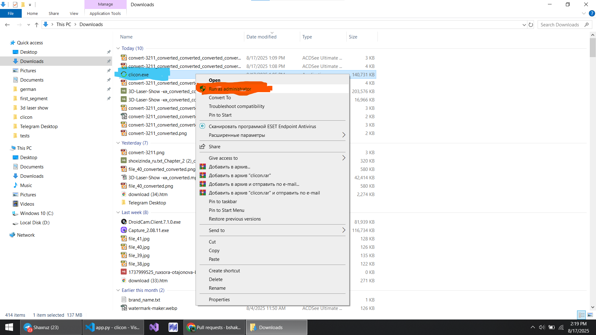
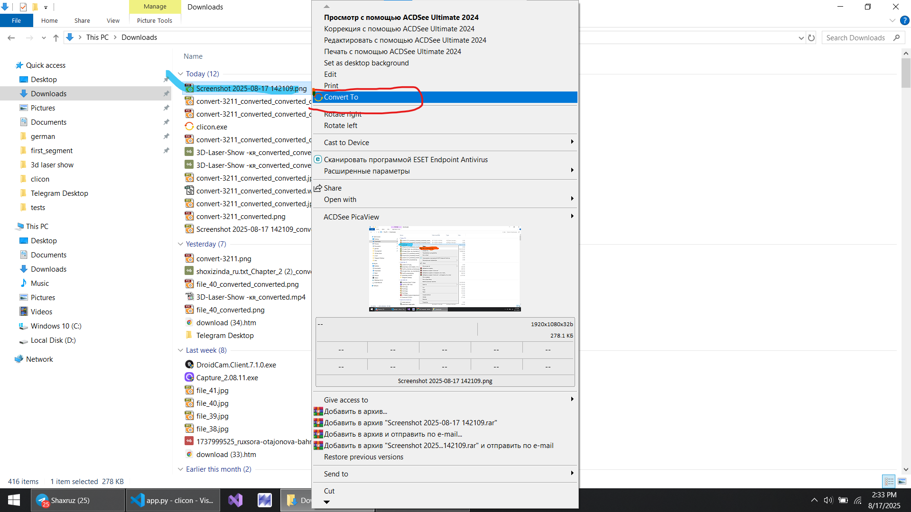
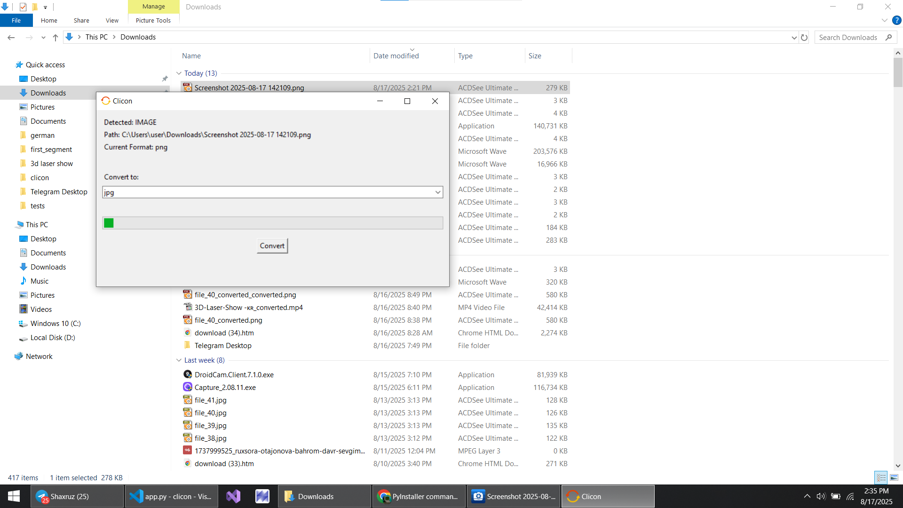

# Easily convert files offline with a couple of clicks on your pc

## Step 1

## Step 2

## Step 3

This application uses FFmpeg licensed under the GNU GPL v3.
FFmpeg is copyright (c) 2000-2025 the FFmpeg developers.
